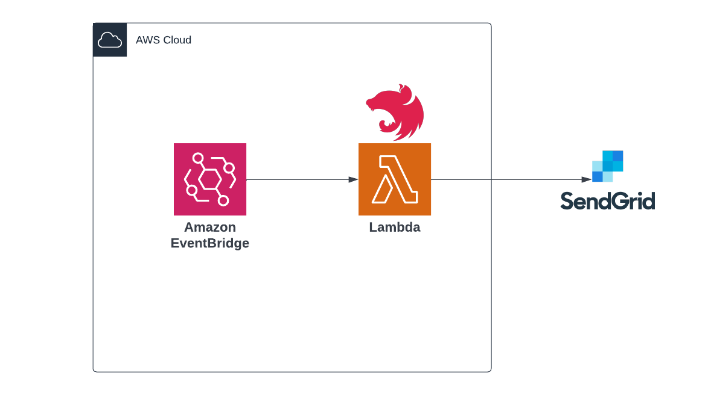

# Event-Driven NestJS

The repo contains an example NestJS app running on AWS Lambda with an EventBridge source. The use case is a simple service that emails a customer when when a payment event is received using Twilio Sendgrid as the email delivery service.

## Architecture



## AWS Lambda & NestJS

This project uses [NestJS Standalone applications](https://docs.nestjs.com/standalone-applications) with AWS Lambda.
NestJS Standalone apps can use the NestJS DI system without starting an entire webserver.

## Setup

1. Create a [SendGrid account](https://sendgrid.com/)

2. Get a [Sendgrid API key](https://docs.sendgrid.com/ui/account-and-settings/api-keys)

3. Add your Sendgrid API key to the AWS SSM with the prefix `/dev/sendgrid/apiKey` using the Secure String type.

4. [Verify an email domain with Sendgrid](https://docs.sendgrid.com/ui/account-and-settings/how-to-set-up-domain-authentication)

5. Update the `.serverless.yml` file with your verified email domain.

## AWS Deployment

```
export AWS_PROFILE=<YOUR_PROFILE>

# package with webpack
yarn build

npx serverless deploy --stage dev
```

## Webpack

The project uses Webpack to bundle the Typescript for NodeJS. The total bundled deployment size is `1.2mb`.

See: https://docs.nestjs.com/faq/serverless#benchmarks

## Events

The service reacts to one `payments.InvoicePaid` event.

The [Event-Carried State Transfer](https://martinfowler.com/articles/201701-event-driven.html) pattern is used to pass around the relevant information about the User that's needed to send an email.

Example event:
```json
{
    "version": "0",
    "id": "c82f1e7d-4b0b-9d75-3f11-89be92935a12",
    "detail-type": "payments.InvoicePaid",
    "source": "payments.api",
    "account": "111111111111",
    "time": "2022-12-04T11:22:08Z",
    "region": "us-east-1",
    "resources": [],
    "detail": {
        "user": {
            "id": 1,
            "email": "user@gmail.com"
        }
    }
}
```
